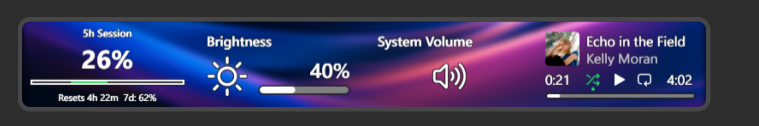
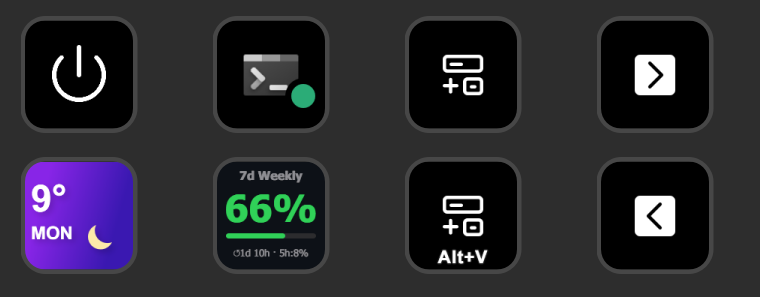

# Claude Code Usage — Stream Deck + Plugin

Displays your Claude Code usage limits directly on your Stream Deck. Two action types are included — one for the **LCD strip** on the Stream Deck +, and one for any standard **key** button.

**Dial action (Stream Deck + LCD strip)**



**Key action (standard button, any Stream Deck)**



## Features

- **Session view**: current 5-hour usage % (large), weekly % in subtitle, time until reset
- **Weekly view**: current 7-day usage % (large), session % in subtitle, time until reset
- **Dial action** — rotate to toggle views, press to refresh, tap touchscreen to toggle
- **Key action** — press to toggle between session and weekly view
- Auto-refreshes every **30 seconds**
- Colour-coded bar: green < 70%, orange 70–89%, red ≥ 90%
- Works on **Windows** and **macOS**

## Compatibility

| Action | Works on |
|---|---|
| **Claude Usage (Key)** | All Stream Deck models |
| **Claude Usage (Dial)** | Stream Deck + only (requires the LCD strip and encoder dials) |

## Requirements

- Stream Deck software ≥ 6.4
- [Node.js](https://nodejs.org/) ≥ 20 (for building only)
- [Claude Code](https://claude.ai/code) installed and logged in (`~/.claude/.credentials.json` must exist)
- `curl` — ships with macOS and Windows 10+
- [Node.js](https://nodejs.org/) ≥ 20 (for building only)
- [Claude Code](https://claude.ai/code) installed and logged in (`~/.claude/.credentials.json` must exist)
- `curl` — ships with macOS and Windows 10+

## Setup

```bash
# 1. Install dependencies
npm install

# 2. Build
npm run build

# 3. Install into Stream Deck
npm run install-plugin
```

Then restart the Stream Deck app. Two actions will appear in the action list under **Developer Tools**:

- **Claude Usage (Dial)** — drag onto an encoder slot on the Stream Deck +
- **Claude Usage (Key)** — drag onto any button on any Stream Deck model

> **Note:** The plugin reads credentials from `~/.claude/.credentials.json`, which is created automatically when you log in to Claude Code. If the credentials expire, open Claude Code once to refresh them.

## Development

```bash
# Watch mode — rebuilds on every save
npm run watch

# After each build, re-run install-plugin and restart Stream Deck to pick up changes
npm run install-plugin
```

Logs are written to:

| Platform | Path |
|---|---|
| Windows | `%APPDATA%\Elgato\StreamDeck\logs\com.pcjtse.claudeusage.log` |
| macOS | `~/Library/Logs/ElgatoStreamDeck/com.pcjtse.claudeusage.log` |

## How it works

1. On startup, reads `~/.claude/.credentials.json` for your OAuth access token.
2. Calls `https://claude.ai/api/oauth/usage` via system `curl` (avoids embedded Node.js DNS/TLS issues with Cloudflare).
3. Parses `five_hour.utilization` and `seven_day.utilization` (0–100 scale) and `resets_at` (ISO timestamp).
4. Renders the result via `setFeedback()` (dial LCD strip) or `setImage()` with an inline SVG (key button).

## Project structure

```
ClaudeCodeUsagePlugin/
├── src/
│   ├── plugin.ts                  # Entry point
│   └── actions/
│       ├── usage-dial.ts          # Dial action (rotate, press, tap)
│       └── usage-key.ts           # Key action (press to toggle view)
│   └── services/
│       ├── claude-api.ts          # Usage API fetch + formatting
│       └── credentials.ts         # Read ~/.claude/.credentials.json
├── com.pcjtse.claudeusage.sdPlugin/
│   ├── manifest.json
│   ├── layouts/usage-layout.json  # LCD strip layout
│   ├── imgs/                      # Plugin and action icons
│   └── bin/plugin.js              # Built output (generated)
├── scripts/
│   └── install-plugin.mjs         # Cross-platform install script
├── rollup.config.mjs
├── tsconfig.json
└── package.json
```

## License

MIT
